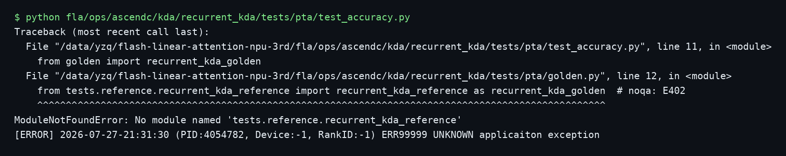
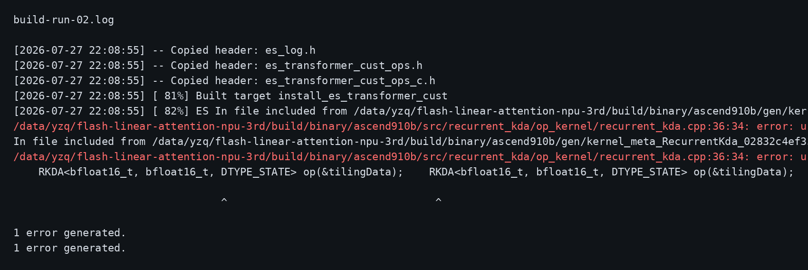
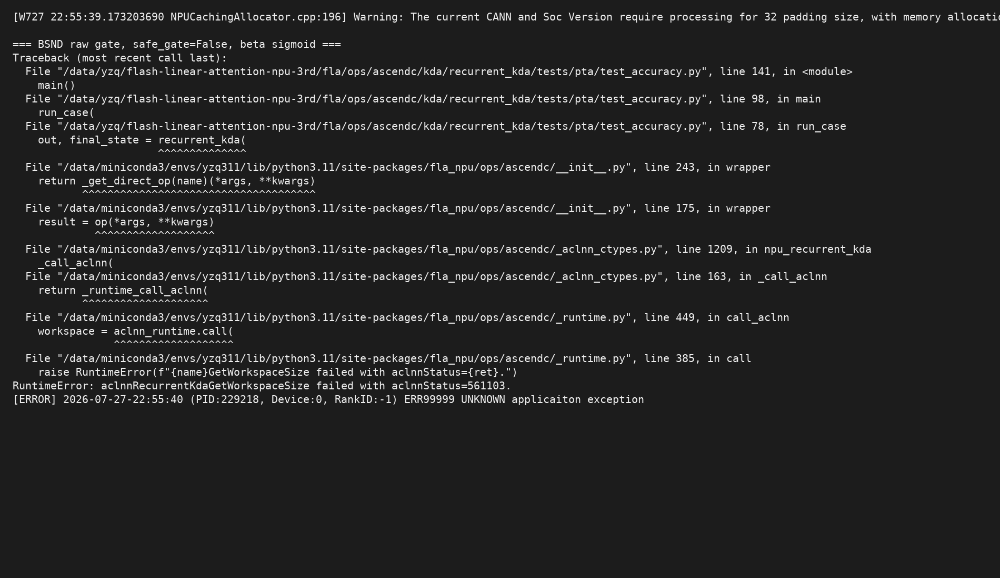
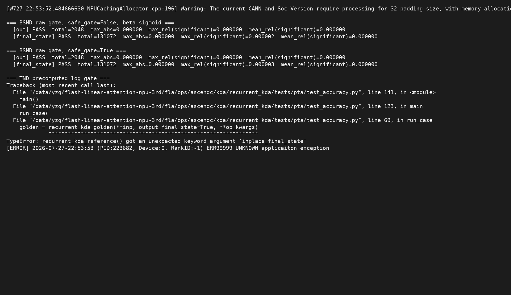

# RecurrentKda 开发问题记录

本文记录 RecurrentKda 4.0 接口升级过程中实际遇到的编译与运行时问题。日志和截图仅用于本地开发验证。

## Issue 01：精度测试无法导入 CPU Reference

- 日期：2026-07-27
- 阶段：运行时（测试启动）
- 状态：已解决
- 触发方式：执行 `tests/pta/test_accuracy.py`

### 现象与报错

```text
ModuleNotFoundError: No module named 'tests.reference.recurrent_kda_reference'
```



### 根因分析

旧版 `golden.py` 依赖仓外或其他分支中的共享 reference，并且通过固定的 `parents[8]` 推导仓库根目录。当前分支没有对应模块，因此测试尚未进入 NPU 算子调用就在导入阶段失败。

### 解决办法

在算子自己的 `tests/pta/golden.py` 中提供纯 PyTorch reference，按竞品 `fused_recurrent_kda_fwd` 的语义实现 Q/K L2Norm、两种 gate、beta sigmoid、BSND/TND、两种 state 布局及 final state，消除对其他工作区的依赖。

### 验证结果

`golden.py` 语法检查通过，精度脚本可以正常完成 CPU golden 计算。

## Issue 02：IR 输入重命名后 kernel dtype 宏未同步

- 日期：2026-07-27
- 阶段：Ascend 910B run 包编译
- 状态：已解决

### 现象与报错

```text
error: use of undeclared identifier 'DTYPE_STATE'
```



### 根因分析

IR 输入从旧名称 `state` 更新为 4.0 原型中的 `initial_state` 后，编译框架生成的类型宏同步变为 `DTYPE_INITIAL_STATE`，但 kernel 入口仍使用旧宏 `DTYPE_STATE`，因此模板实例化失败。

### 解决办法

仅将 kernel 入口的状态类型宏更新为 `DTYPE_INITIAL_STATE`，不改变原有模板和计算路径。

### 验证结果

方式 B 的 910B 单算子 run 包重新编译成功，BF16 和 FP32 state 对应 kernel binary 均成功生成。

## Issue 03：GetWorkspaceSize 阶段进入 AutoTiling 并报缺少 `_pattern`

- 日期：2026-07-27
- 阶段：运行时（aclnn workspace/tiling 初始化）
- 状态：已解决

### 现象与报错

```text
OpName:[RecurrentKda] "compile info not contain [_pattern]"
InitTilingParseCtx failed
aclnnRecurrentKdaGetWorkspaceSize failed with aclnnStatus=561103
```



### 根因分析

kernel JSON 的 `compileInfo` 为空在本项目的自定义 tiling 算子中是正常现象；正常路径应由 `IMPL_OP_OPTILING` 注册的 `TilingParse` 和 tiling 函数处理。报错说明运行时没有命中 custom tiling，回退到了 CANN AutoTiling parser，后者才会要求 `_pattern`。

开发中确认了两个必要条件：

1. 必须保留原实现的 `REGISTER_OPS_TILING_TEMPLATE`、`TilingRegistry::DoTilingImpl` 和 `TilingParse` 注册。
2. 测试会先导入 `torch_npu`，再首次调用 wheel wrapper。仅在 wrapper 中追加 `ASCEND_CUSTOM_OPP_PATH` 太晚，已经初始化的 CANN 不会回溯加载 wheel 内嵌的 `liboptiling.so`。

### 解决办法

- 恢复并保留原有 custom tiling 模板、tiling 函数和 parse 注册。
- wheel 在加载 `libcust_opapi.so` 前，使用全局符号模式主动加载内嵌 `op_tiling/liboptiling.so`，使注册在 `GetWorkspaceSize` 前完成。
- 不向 kernel JSON 人工添加 `_pattern`；该字段属于 AutoTiling，不是本算子的正确修复方向。

### 验证结果

不额外设置 `ASCEND_CUSTOM_OPP_PATH` 或 `LD_PRELOAD`，只加载用户指定 conda/CANN 环境，精度脚本可以直接运行并命中 custom tiling。

## Issue 04：新增 inplace 属性未同步到测试 golden 签名

- 日期：2026-07-27
- 阶段：运行时（第三个精度 case 的 CPU golden）
- 状态：已解决

### 现象与报错

```text
TypeError: recurrent_kda_reference() got an unexpected keyword argument 'inplace_final_state'
```



### 根因分析

TND/K-first 用例通过 `op_kwargs` 同时调用 NPU wrapper 和 CPU golden。aclnn 4.0 接口增加 `inplace_final_state` 后，wrapper 已支持该属性，但本地 reference 的函数签名未同步，导致在进入 NPU 调用前抛出 `TypeError`。

### 解决办法

在 reference 签名中增加 `inplace_final_state`。该参数只决定输出 state 的写回目标，不改变 reference 内部数值递推，因此在 golden 中接收后显式忽略。

### 验证结果

TND、K-first、无初始 state、非原地 final state 用例执行并通过精度比较。

## 最终构建与验收

- Ascend 910B 单算子 run 包：编译成功。
- Python wheel：编译并安装成功。
- `tests/pta/test_accuracy.py`：3 个场景全部通过。
- 覆盖场景：BSND raw gate、safe gate、beta sigmoid、TND precomputed log gate、V-first/K-first state、原地/非原地 final state、无初始 state。
